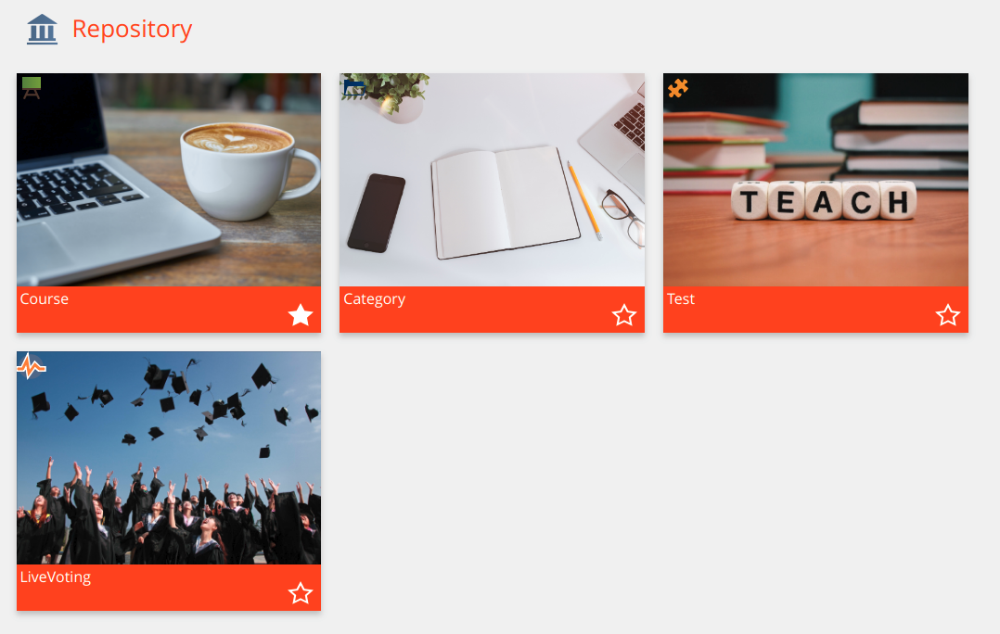
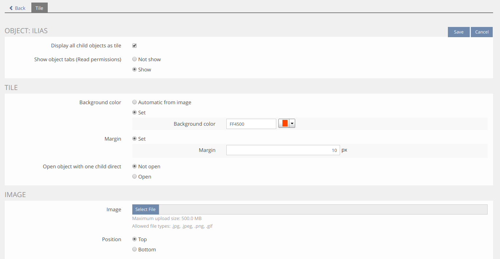

## Installation

### Install SrTile-Plugin
Start at your ILIAS root directory
```bash
mkdir -p Customizing/global/plugins/Services/UIComponent/UserInterfaceHook
cd Customizing/global/plugins/Services/UIComponent/UserInterfaceHook
git clone https://github.com/studer-raimann/SrTile.git SrTile
```
Update, activate and config the plugin in the ILIAS Plugin Administration

### Some screenshots
Tiles:


Tab:


Tile config:


### Requirements
* ILIAS 5.3 or ILIAS 5.4
* PHP >=7.0

### Adjustment suggestions
* External users can report suggestions and bugs at https://plugins.studer-raimann.ch/goto.php?target=uihk_srsu_PLSRTILE
* Adjustment suggestions by pull requests via github
* Customer of studer + raimann ag: 
	* Adjustment suggestions which are not yet worked out in detail by Jira tasks under https://jira.studer-raimann.ch/projects/PLSRTILE
	* Bug reports under https://jira.studer-raimann.ch/projects/PLSRTILE

### ILIAS Plugin SLA
Wir lieben und leben die Philosophie von Open Source Software! Die meisten unserer Entwicklungen, welche wir im Kundenauftrag oder in Eigenleistung entwickeln, stellen wir öffentlich allen Interessierten kostenlos unter https://github.com/studer-raimann zur Verfügung.

Setzen Sie eines unserer Plugins professionell ein? Sichern Sie sich mittels SLA die termingerechte Verfügbarkeit dieses Plugins auch für die kommenden ILIAS Versionen. Informieren Sie sich hierzu unter https://studer-raimann.ch/produkte/ilias-plugins/plugin-sla.

Bitte beachten Sie, dass wir nur Institutionen, welche ein SLA abschliessen Unterstützung und Release-Pflege garantieren.
