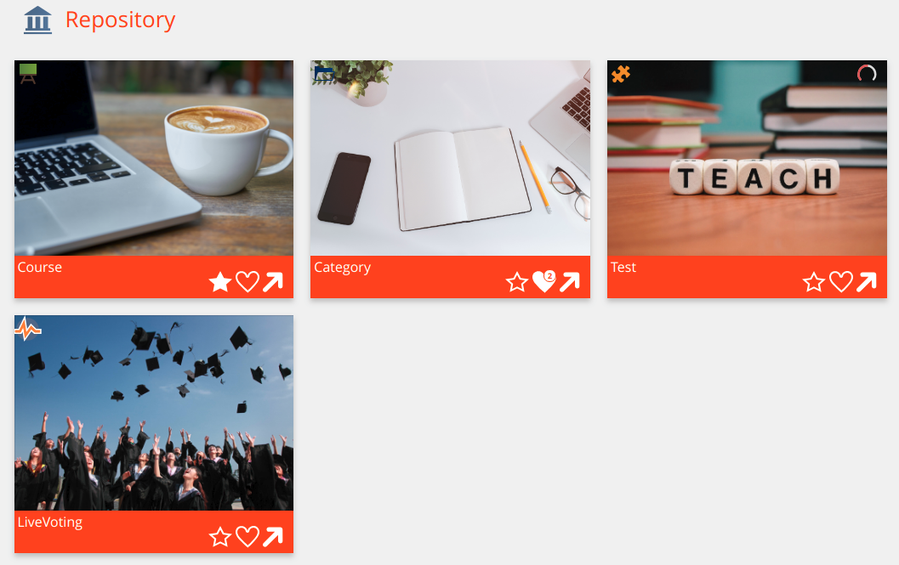
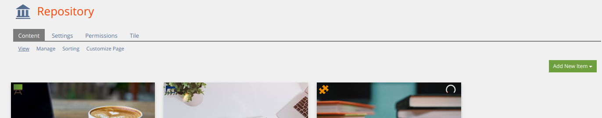

Tiles:


Tab:


Tile config:


## Custom event plugins
If you need to adapt some custom SrTile changes which can not be configured to your needs, SrTile will trigger some events, you can listen and react to this in an other custom plugin (plugin type is no matter)

First create or extend a `plugin.xml` in your custom plugin (You need to adapt `PLUGIN_ID` with your own plugin id) to tell ILIAS, your plugins wants to listen to SrTile events (You need also to increase your plugin version for take effect)

```xml
<?php xml version = "1.0" encoding = "UTF-8"?>
<plugin id="PLUGIN_ID">
	<events>
		<event id="Plugins/SrTile" type="listen" />
	</events>
</plugin>
```

In your plugin class implement or extend the `handleEvent` method

```php
...
require_once __DIR__ . "/../../SrTile/vendor/autoload.php";
...
class ilXPlugin extends ...
...
	/**
	 * @inheritDoc
	 */
	public function handleEvent(/*string*/ $a_component, /*string*/ $a_event, /*array*/ $a_parameter)/*: void*/ {
		switch ($a_component) {
			case IL_COMP_PLUGIN . "/" . ilSrTilePlugin::PLUGIN_NAME:
				switch ($a_event) {
					case ilSrTilePlugin::EVENT_...;
						...
						break;

					default:
						break;
				}
				break;

			default:
				break;
		}
	}
...
```

| Event | Parameters | Purpose |
|-------|------------|---------|
| `ilSrTilePlugin::EVENT_CHANGE_TILE_BEFORE_RENDER` | `tile => object<Tile>` | Change some tile properties before it will be rendered |
| `ilSrTilePlugin::EVENT_SHOULD_NOT_DISPLAY_ALERT_MESSAGE` | `lang_module => string`<br>`lang_key => string`<br>`alert_type => string`<br>`should_not_display => &array` | May you want not to to display all alert messages, so you can filter and add `true` to `should_not_display` (Please note `should_not_display` is a reference variable, if it should not works) |
